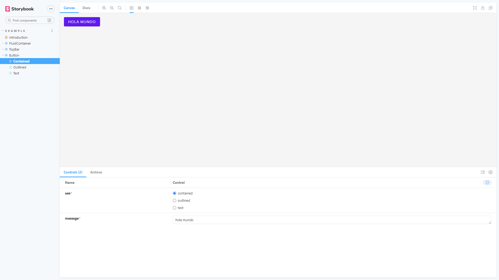

# @makinox/makinox-ui

A little ui library.

## Used

- React
- Storyboard

Link to [makinox-ui!](https://makinox-ui.jesusbossa.dev/)

## Contributing

If you're interested in contributing to project, please read our [contributing docs](https://github.com/makinox/makinox-ui/blob/main/.github/CONTRIBUTING.md) **before submitting a pull request**.
## Available Scripts

In the project directory, you can run:

### `yarn start`

Runs the app in the development mode.\
Open [http://localhost:3000](http://localhost:3000) to view it in the browser.

The page will reload if you make edits.\
You will also see any lint errors in the console.

### `yarn build`

Builds the app for production to the `dist` folder.\
It correctly bundles React in library production mode and optimizes the build for the best performance.

### `yarn storybook`

Runs the storybook in the development mode.\
Open [http://localhost:6006](http://localhost:6006) to view it in the browser.

The page will reload if you make edits.

### `yarn build-storybook`

Builds the app for production to the `storybook-static` folder.\
It correctly bundles React in library production mode and optimizes the build for the best performance.
